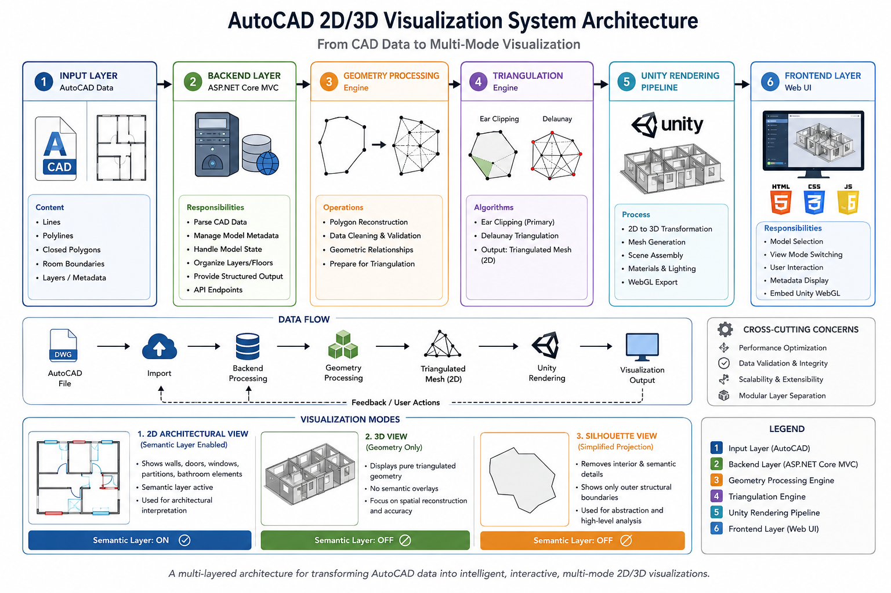

# System Architecture Diagram

## 📌 Visual Representation

---

## 🧭 Overview

This document describes the high-level architecture of the AutoCAD-based 2D/3D visualization system.

The system transforms raw CAD geometry into multiple visualization modes through a structured multi-layer pipeline.

It is designed with strict separation between:
- geometry processing
- semantic interpretation
- rendering
- user interaction

---

## 🏗️ System Layers

### 1. Input Layer (AutoCAD)

The system starts from CAD-generated data containing:
- polylines
- room boundaries
- architectural layouts

This data represents raw geometric information without semantic structure.

---

### 2. Backend Layer (ASP.NET Core MVC)

Responsible for:
- parsing CAD-derived data
- organizing model metadata
- managing model structure and state
- preparing data for geometry processing

This layer does NOT perform rendering or triangulation.

---

### 3. Geometry Processing Layer

Transforms raw CAD geometry into structured mesh data.

Key operations:
- polygon reconstruction
- triangulation (Ear Clipping / Delaunay)
- cleaning and validation of geometry
- preparation for 3D transformation

Output: triangulated 2D mesh structures

---

### 4. 3D Rendering Layer (Unity Viewer)

Converts processed geometry into real-time visual output.

Responsibilities:
- mesh generation (Unity Mesh objects)
- scene construction
- WebGL export for browser execution
- rendering optimization

Output: interactive 3D model

---

### 5. Semantic Architectural Layer (2D ONLY)

This is a specialized interpretation layer applied exclusively in **2D visualization mode**.

It detects and renders architectural elements such as:
- walls
- doors
- windows
- interior partitions
- bathroom structures

⚠️ Important constraint:
This layer is NOT used in:
- 3D visualization mode
- silhouette mode

It exists only for enhanced architectural understanding in 2D.

---

### 6. Presentation Layer (Frontend)

Provides user interaction and system control.

Features:
- model selection
- visualization mode switching
- UI interaction handling
- integration with backend and Unity viewer

Technologies:
- HTML
- CSS
- JavaScript

---

## 🔄 End-to-End Data Flow

AutoCAD Input  
→ Backend Processing (ASP.NET Core MVC)  
→ Geometry Reconstruction  
→ Triangulation Engine  
→ Unity Rendering Pipeline  
→ Visualization Mode Selection  
→ Frontend Interaction Layer  

---

## 🎯 Key Design Principles

### 1. Separation of Concerns
Each layer has a strictly defined responsibility.

### 2. Context-Dependent Rendering
Different visualization modes apply different levels of abstraction:
- 2D → semantic + geometry
- 3D → geometry only
- silhouette → simplified structure

### 3. Semantic Isolation
Architectural interpretation exists only in 2D mode and is intentionally excluded from 3D rendering.

---

## 📌 Summary

The system represents a complete pipeline for transforming CAD data into interactive architectural visualizations, combining:

- computational geometry
- 3D rendering
- semantic interpretation (2D only)
- web-based interaction
